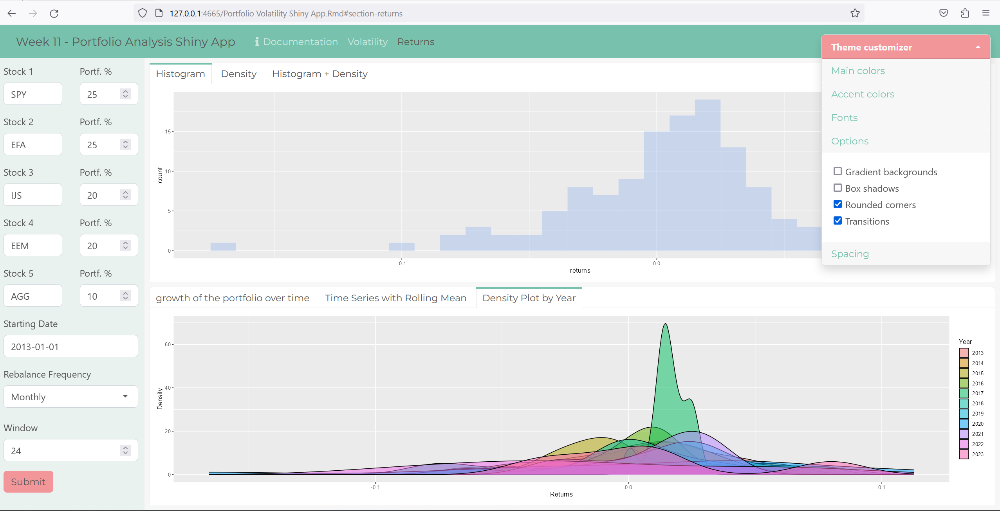

# Portfolio-Analysis-Rshiny
App written in R Shiny using Markdown documents. This app is designed to facilitate the process of evaluating and analyzing an investment portfolio to determine its performance, risk, and potential for future returns.

